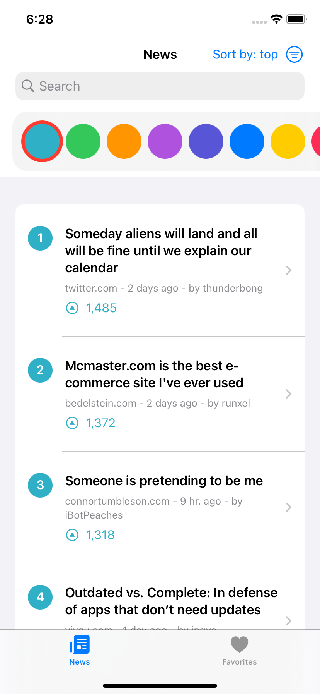

# Hacker News Reader
A convenient way to read stories from the tech news website Hacker News (HN).

## Install
Coming soon

## Screenshots

## Features
- Browse 100 top or latest stories
- Save favorites
- Search
- Customizable color with dark/light mode support

## Technologies Used
- SwiftUI
- Core Data
- MVVM
- Networking with JSON
